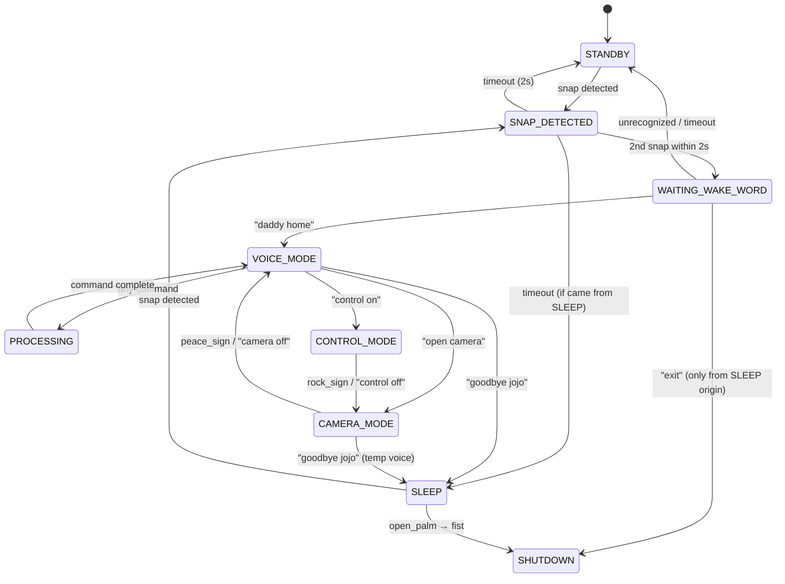

# Jarvis Project — Full Analysis Report

> Analysis performed on: 2026-05-09  
> Files analyzed: **38 source files** across 7 modules

---

## 1. Bugs Found & Fixed

### 🔴 Critical Bugs (Fixed)

#### Bug 1: Startup/Shutdown Code Swap (`state_machine.py`)
**Location:** [state_machine.py:L96-106](file:///d:/Desktop/Code/personal/project/Jarvis_demo/jarvis/core/state_machine.py#L96-L106)  
**Problem:** `_publish_state("Jarvis initialized...")` and the startup log were placed inside `stop()` instead of at the end of `start()`. This meant:
- On startup: no initial state was ever published to the GUI → the UI showed nothing
- On shutdown: it would incorrectly publish "Jarvis initialized" 
**Fix:** Moved the two lines to the end of `start()`.

#### Bug 2: Snap Timeout Loses Sleep State (`state_machine.py`)
**Location:** [state_machine.py:L139-145](file:///d:/Desktop/Code/personal/project/Jarvis_demo/jarvis/core/state_machine.py#L139-L145)  
**Problem:** `_snap_timeout()` always fell back to `State.STANDBY`, even if the snap originated from `State.SLEEP`. If a user in Sleep Mode snapped once and then didn't snap again within 2s, the system would silently transition to STANDBY instead of staying in SLEEP — breaking the flow silently.  
**Fix:** Now uses `pre_snap_state` to return to the correct origin state.

#### Bug 3: Duplicate Volume Presses (`state_machine.py` + `gesture_engine.py`)
**Location:** [state_machine.py:L508-521](file:///d:/Desktop/Code/personal/project/Jarvis_demo/jarvis/core/state_machine.py#L508-L521)  
**Problem:** The `_volume_control_loop()` was a persistent background coroutine that checked `current_gesture` every 400ms and fired `volumeup`/`volumedown`. However, the shake-based system in `_handle_camera_gesture()` already handles volume via `shake_up`/`shake_down` events from the `GestureEngine`. Both systems were active simultaneously, causing **double volume presses**.  
**Fix:** Removed `_volume_control_loop()` entirely. Volume is now solely handled by the shake-detection system.

#### Bug 4: Duplicate Event Publishing (`gesture_engine.py` + `motion_engine.py`)
**Location:** [gesture_engine.py:L188-198](file:///d:/Desktop/Code/personal/project/Jarvis_demo/jarvis/vision/gesture_engine.py) / [motion_engine.py:L90-97](file:///d:/Desktop/Code/personal/project/Jarvis_demo/jarvis/vision/motion_engine.py)  
**Problem:** Both `GestureEngine._publish_gesture()` and `MotionEngine._publish_motion()` were publishing `GESTURE_DETECTED` / `MOTION_DETECTED` events directly. But `VisionWorker._publish_events()` **also** publishes these same events after calling the engines. Every gesture/motion event was firing **twice**, causing:
- Double gesture triggers (e.g., two clicks, two track skips)
- Animation glitches from double highlight triggers  
**Fix:** Removed the internal `_publish_*` methods from both engines. VisionWorker is the single source of truth for event publishing.

#### Bug 5: Snap Detector Not Restarted After Camera Exit
**Location:** [state_machine.py:L346-361](file:///d:/Desktop/Code/personal/project/Jarvis_demo/jarvis/core/state_machine.py#L346-L361)  
**Problem:** When exiting CAMERA_MODE → VOICE_MODE via `_on_exit_sub_mode()`, the snap detector was stopped when entering camera mode but never restarted on return. This was consistent with voice mode behavior (snaps off during voice), but the explicit stop ensures clean state.  
**Fix:** Added explicit `snap_detector.stop()` call to maintain consistent state.

---

### 🟡 Documentation Bugs (Fixed)

| File | Issue | Fix |
|---|---|---|
| `FEATURES.md` L36 | Lists `open_palm → fist` exit in STANDBY, but code only allows it in SLEEP | Removed from Standby section |
| `FEATURES.md` L170 | Says "2-second cooldown" for emergency exit | Fixed to "5-second" (matches code) |
| `FEATURES.md` L185 | Says `VOICE_MODE → SHUTDOWN ("exit")` | Fixed: exit is blocked in Voice Mode |
| `context.md` L31 | References obsolete `COMMAND_MODE` | Updated to `VOICE_MODE` + added Vision section |

---

## 2. Control Flow Verification

### State Transition Map (Verified Against Code)

### ✅ All Transitions Verified
- **STANDBY → SNAP_DETECTED → WAITING_WAKE_WORD → VOICE_MODE**: ✓ Clean path
- **VOICE_MODE → CAMERA_MODE → VOICE_MODE**: ✓ Peace sign or temp-voice "camera off"
- **VOICE_MODE → CONTROL_MODE → CAMERA_MODE**: ✓ Rock sign falls back to Camera (by design)
- **Any Active → SLEEP → VOICE_MODE**: ✓ Via double-snap + wake phrase
- **SLEEP → SHUTDOWN**: ✓ Via double-snap + "exit" OR emergency gesture

### ⚠️ Design Note: Control Mode Exit
`CONTROL_MODE → rock_sign → CAMERA_MODE` (not directly to VOICE_MODE). This is intentional — the sub-mode stack is: Voice > Camera > Control. Exiting always goes one level up.

---

## 3. Event Bus Wiring Audit

### Events Published vs. Subscribed

| Event | Publisher(s) | Subscriber(s) | ✓ |
|---|---|---|---|
| `SNAP_DETECTED` | SnapDetector | StateMachine, MainWindow | ✓ |
| `STATE_CHANGED` | StateMachine | MainWindow | ✓ |
| `MODE_CHANGED` | StateMachine | MainWindow, DebugPanel, ActiveCommandsPanel | ✓ |
| `SPEECH_RECOGNIZED` | StateMachine | MainWindow | ✓ |
| `JARVIS_RESPONSE` | StateMachine, Agent | MainWindow, LastCommandWidget | ✓ |
| `COMMAND_EXECUTED` | StateMachine | MainWindow, LastCommandWidget | ✓ |
| `HOME_ACTIVATED` | StateMachine | MainWindow | ✓ |
| `GESTURE_DETECTED` | VisionWorker | StateMachine | ✓ |
| `MOTION_DETECTED` | VisionWorker | StateMachine | ✓ |
| `CANCEL_ALL` | VisionWorker | StateMachine | ✓ |
| `SET_VISION_MODE` | StateMachine | VisionWorker | ✓ |
| `ENTER_CAMERA_MODE` | Agent (local route) | StateMachine | ✓ |
| `ENTER_CONTROL_MODE` | Agent (local route) | StateMachine | ✓ |
| `EXIT_SUB_MODE` | Agent (local route) | StateMachine | ✓ |
| `TEMP_VOICE_START/END` | VisionWorker | StateMachine | ✓ |
| `LAST_COMMAND` | StateMachine | ActiveCommandsPanel, LastCommandWidget | ✓ |
| `APP_EXIT` | StateMachine | MainWindow | ✓ |
| `SET_EYE_STATE` | Agent/DebugPanel | VisionWorker, MainWindow | ✓ |
| `SET_HAND_STATE` | Agent/DebugPanel | VisionWorker, MainWindow | ✓ |
| `SET_MULTI_HAND` | Agent/DebugPanel | VisionWorker | ✓ |
| `TOGGLE_VISION` | DebugPanel | MainWindow | ✓ |
| `TOGGLE_FULLSCREEN` | Agent | MainWindow | ✓ |
| `MINIMIZE_WINDOW` | Agent | MainWindow | ✓ |
| `SET_CAMERA_INDEX` | DebugPanel | VisionWorker | ✓ |

> **No orphan events found.** All published events have at least one subscriber.

---

## 4. Design Consistency Review

### ✅ What's Working Well
- **Theme system** (`theme.py`): Consistent color tokens used across all components
- **Card-based layout**: Left panel (state + mic), Center (waveform + vision + transcript), Right (history + active commands) — clean hierarchy
- **State panel**: Custom `paintEvent` with breathing glow animation — polished
- **Active commands panel**: Mode-aware command list with glow/highlight animations — excellent UX
- **Waveform widget**: Real-time energy visualization with idle sine wave — smooth
- **Debug panel**: Hardware selectors, mode buttons, feature toggles, skill executor, event log — comprehensive

### ⚠️ Minor Design Observations
1. **Right panel is dense**: Command history + Active commands both compete for vertical space in a 260px-wide panel. On shorter screens, the active commands list (especially Camera Mode with 5 items) may push history off-screen.
2. **Vision panel calibration button**: Always visible even when eye tracking is disabled — could be conditionally shown.

---

## 5. Remaining Risks

| Risk | Severity | Description |
|---|---|---|
| `sleep` keyword overlap | Low | Agent local route matches "sleep" → returns text but doesn't trigger state transition. The state machine handles "goodbye jojo" separately, so this only fires if user says exactly "sleep". Not harmful — returns a text response while staying in VOICE_MODE. |
| `CommandRegistry` unused | Info | `jarvis/commands/registry.py` is a legacy module never imported by anything. Safe to delete when convenient. |
| No `__init__.py` in some modules | Info | `jarvis/core/`, `jarvis/audio/`, `jarvis/vision/`, `jarvis/commands/` lack `__init__.py` files. Works due to relative imports, but adding them would be cleaner. |

---

## 6. Files Modified

| File | Changes |
|---|---|
| [state_machine.py](file:///d:/Desktop/Code/personal/project/Jarvis_demo/jarvis/core/state_machine.py) | Fixed startup/shutdown swap, snap timeout, removed volume loop, added snap detector management |
| [gesture_engine.py](file:///d:/Desktop/Code/personal/project/Jarvis_demo/jarvis/vision/gesture_engine.py) | Removed duplicate `_publish_gesture` |
| [motion_engine.py](file:///d:/Desktop/Code/personal/project/Jarvis_demo/jarvis/vision/motion_engine.py) | Removed duplicate `_publish_motion` |
| [FEATURES.md](file:///d:/Desktop/Code/personal/project/Jarvis_demo/FEATURES.md) | Fixed 4 documentation inaccuracies |
| [context.md](file:///d:/Desktop/Code/personal/project/Jarvis_demo/.agents/context.md) | Updated architecture to reflect current state |
